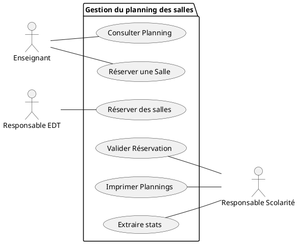

```plantuml
@startuml exemple11.png
actor Enseignant as ens
actor "Responsable EDT" as edt
actor "Responsable Scolarité" as sco

package "Gestion du planning des salles" {
left to right direction 
ens -- (Consulter Planning)
ens -- (Réserver une Salle)
edt -- (Réserver des salles)
(Valider Réservation) -- sco
(Imprimer Plannings) -- sco
(Extraire stats) -- sco
}
@enduml
```