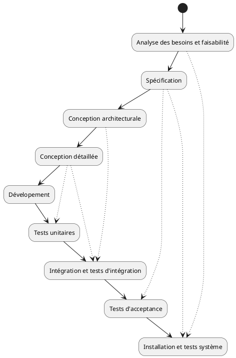

```plantuml
@startuml

(*) --> "Analyse des besoins et faisabilité" as a1
a1 --> "Spécification" as a2
a2 --> "Conception architecturale" as a3
a3 --> "Conception détaillée" as a4
a4 --> "Dévelopement" as a5
a5 --> "Tests unitaires" as a6
a6 --> "Intégration et tests d'intégration" as a7
a7 --> "Tests d'acceptance" as a8
a8 --> "Installation et tests système" as a9

a1 ..> a9
a2 ..> a9
a2 ..> a8
a3 ..> a7
a4 ..> a7
a4 ..> a6

@enduml
```