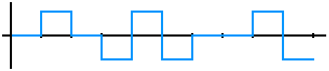
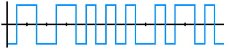

# TD2

## Exercice 1: Transmission en bande de base

### Codage tout-ou-rien

1. 
2. Valence de **2** car **2 états**.
3.   
   |Inconvénients|
   :-:
   Confusion entre le signal nul et 0 $_a$|
   Difficile de mettre en place un courant nul $_b$|
   Échauffement de la ligne car courant continu $_c$|
   Synchronisation des horloges difficile à mettre en place $_d$|
4. On met en place un courant négatif pour désigner l'absence de signal.

### Codage NRZ (non-retour à zéro)

1. L'absence de message est codé par un courant négatif.
2. Valence de **2**.
3. 
4. Inconvénients *c* et *d*.

### Codage Bipolaire

1. Inconvénients *c* et *d*.
2. Valence de **3**.
3. 
4. Inconvénient *a*.

### Codage Manchester

1. Tous les inconvénients sont résolus
2. Valence de **2**.
3. 
4. On réduit le débit à cause du codage binaire. Chacun possède deux états.

## Exercice 2: Codage Manchester

1. `100101100`
2. `110111010`
3. 

## Exercice 3

1. V = 2 & R = 8000 Bd  
$D = R \times \log_2{V}$  
$D = 8000 \times \log_2{2}$  
$D = 8000\ bits/s$  
1. V = 4
$D = 8000 \times \log_2{4}$  
$D = 16000\ bits/s$  

## Exercice 4

1. $V = 2$ & $D = 20000$  
$R = \frac{D}{V}$  
$R = 20 000$  

2. Plage de Fréquence: 10kHz ~ 25kHz. $V = 2$  
$D = 2F\log_2({V})$  
$D = 2F = 30\ kb/s \rightarrow insuffisant$  

3. Plage de fréquence: 10kHz ~ 20kHz. Débit: 20 kB/s.  
$D = F\log_2({1 + \frac{S}{B}})$  
$20 = 10 \log_2({1 + \frac{S}{B}})$  
$2 =\log_2({1 + \frac{S}{B}})$  
$4 =1 + \frac{S}{B}$  
$\frac{S}{B} = 3$

## Exercice 5

1. V $\neq$ 2.   
   V $=$ 4 $=$ 2$^2$ $\rArr$ $^2$ est le nombre de bits.

2. 01 | 10 | 00 | 11 | 10 | 10 | 01 | 11 | 00 
3. Amplitude-Fréquence.